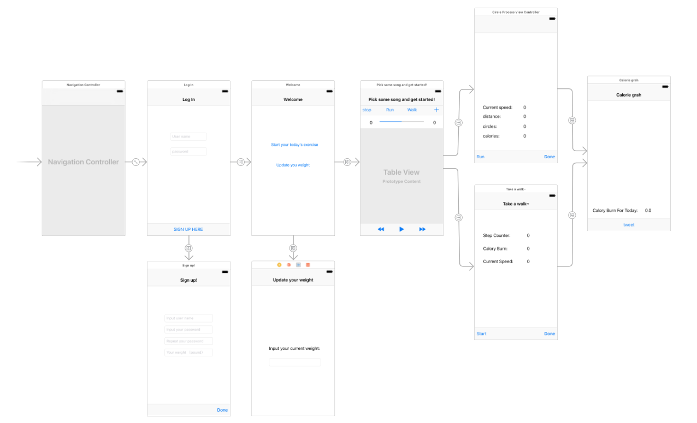

## Android Malware detection

### Component-API Linkage for Android Malware Detection (CAPIL)

Burn Calorie which is app design for ios system. Major functions include a foot step counter on walking exercise, speed calculator on jogging exercise, share exercise result (Burned Calorie, number of feet or jogging, number of steps on walking) on Facebook/Twitter and a line chart to keep track of user's daily Calorie Burn. Calorie burn is update every second during the exercise based on user's weight and current speed.The main advantage of the App is to avoid using GPS usage which eats battery fast and contains security hazard. Accelerator is used in combination with ware analysis algorithm instead to count the foot step and current speed.

  

